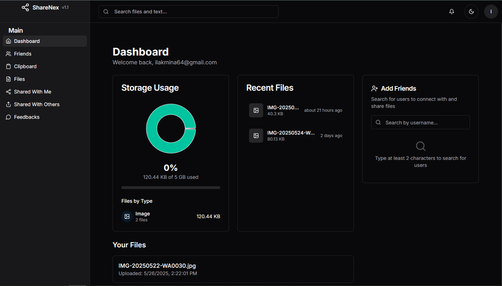
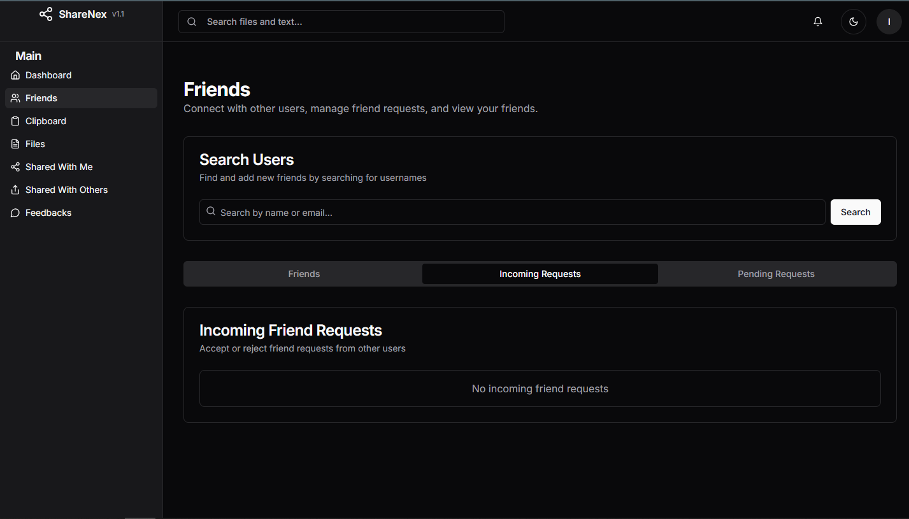
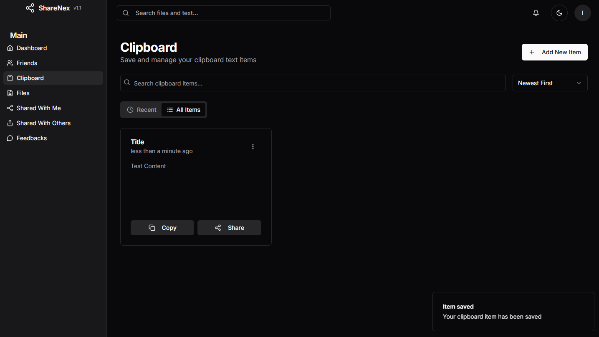
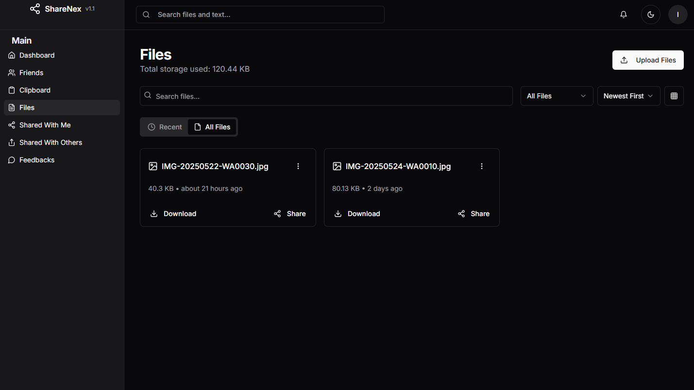

# ShareNex

  

> **ShareNex** is a secure platform for sharing files and text between users. Built with Next.js, Supabase, and a modern UI, it offers a seamless and privacy-focused sharing experience.

[🌐 Live Website](https://share-nex.vercel.app)

---

## 🚀 Features

- **Secure File Sharing:** Share files with friends or anyone, with privacy and security.
- **Clipboard Sharing:** Instantly share text or clipboard content.
- **Friend System:** Add, accept, or reject friend requests for controlled sharing.
- **Modern Dashboard:** Intuitive dashboard to manage files, friends, and shared content.
- **Responsive Design:** Works beautifully on desktop and mobile.
- **Dark/Light Theme:** Switch between light and dark modes.
- **Feedback System:** Users can send feedback and optionally upload images.

---

## 📸 Screenshots

  
  
  
  

---

## 🛠️ Tech Stack

- **Framework:** [Next.js](https://nextjs.org/)
- **Backend:** [Supabase](https://supabase.com/)
- **UI:** [Tailwind CSS](https://tailwindcss.com/), [Radix UI](https://www.radix-ui.com/), [shadcn/ui](https://ui.shadcn.com/)
- **Analytics:** [Vercel Analytics](https://vercel.com/analytics)

---

## 📄 Copyright

This is a **copyrighted project** and is **not open source**. All rights reserved by the ShareNex team. Unauthorized copying, distribution, or use is strictly prohibited.

---

## 🙏 Acknowledgements

- [Next.js](https://nextjs.org/)
- [Supabase](https://supabase.com/)
- [shadcn/ui](https://ui.shadcn.com/)
- [Radix UI](https://www.radix-ui.com/)
- [Tailwind CSS](https://tailwindcss.com/)

---

> _Made with ❤️ by the ShareNex team._